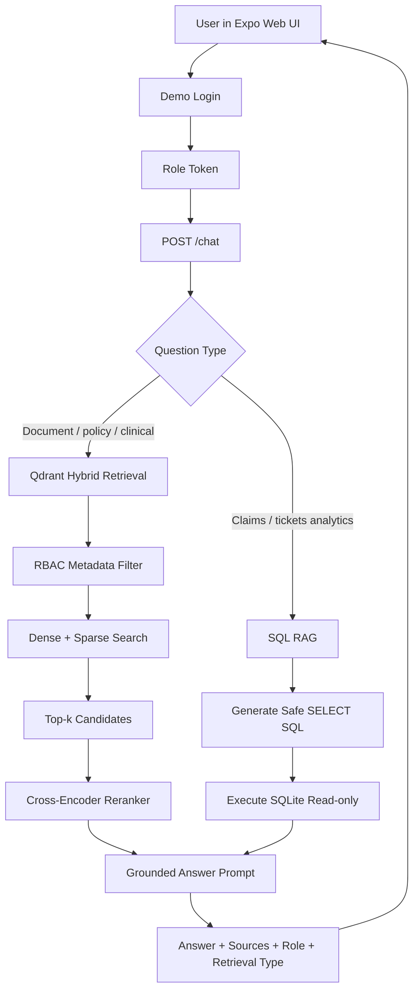
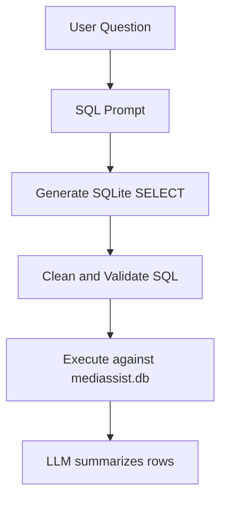

# MediBot

MediBot is a full-stack medical RAG assistant built for the MediAssist assignment. It combines role-based access control, PDF/Markdown ingestion, Qdrant hybrid retrieval, cross-encoder reranking, SQL RAG over SQLite, a FastAPI backend, and an Expo web frontend.

The project is designed as an interview/reference repository, so this README explains not only how to run it, but also why the major architecture choices were made.

## Features

- Role-based demo login for `doctor`, `nurse`, `billing_executive`, `technician`, and `admin`.
- RBAC enforced during vector retrieval using Qdrant metadata filters.
- Assignment data ingestion from `mediassist_data`.
- Docling PDF parsing with heading/table-aware chunking.
- Dense + sparse hybrid retrieval in Qdrant.
- Cross-encoder reranking after initial retrieval.
- SQL RAG over `mediassist.db` for claims and maintenance-ticket questions.
- Source metadata returned with every RAG response.
- Frontend shows active role, allowed collections, retrieval type, and sources.
- Grounded generation with missing-context handling.

## Assignment Data

The app is configured to ingest from:

```text
/Users/v0s05ew/Downloads/Medibot_Assignment_Resources/mediassist_data
```

Expected data layout:

```text
mediassist_data/
├── billing/
├── clinical/
├── db/
│   └── mediassist.db
├── equipment/
├── general/
└── nursing/
```

The SQLite database contains:

- `claims`
- `maintenance_tickets`

## Architecture



## Role Access

| Role | Accessible Collections | SQL RAG |
|---|---|---|
| `doctor` | `clinical`, `general` | No |
| `nurse` | `nursing`, `general` | No |
| `billing_executive` | `billing`, `general` | Yes |
| `technician` | `equipment`, `general` | No |
| `admin` | all collections | Yes |

RBAC is not only a frontend display feature. Each vector chunk stores:

- `source_document`
- `collection`
- `access_roles`
- `section_title`
- `chunk_type`

The backend applies a Qdrant filter before retrieval so unauthorized chunks are not retrieved for the user role.

## Project Structure

```text
medibudi/
├── app/
│   ├── api/v1/endpoints.py      # login, chat, collections endpoints
│   ├── core/
│   │   ├── config.py            # settings
│   │   ├── rbac.py              # role and collection rules
│   │   └── session.py           # in-memory demo sessions
│   ├── generation/              # LLM setup and prompts
│   ├── ingestion/               # Docling loading, chunking, Qdrant seeding
│   ├── retrieval/               # Qdrant filters and reranker
│   ├── rag_pipeline.py          # role-aware document RAG
│   └── sql_rag.py               # SQLite SQL RAG
├── frontend/                    # Expo web UI
├── ingest.py                    # rebuild vector DB
├── main.py                      # FastAPI entrypoint
├── requirements.txt
└── README.md
```

## Setup

Create `.env`:

```bash
cp .env.example .env
```

Example configuration:

```text
GROQ_API_KEY=your_groq_api_key_here
LLM_MODEL=openai/gpt-oss-20b
EMBEDDING_MODEL=all-MiniLM-L6-v2
SPARSE_EMBEDDING_MODEL=Qdrant/bm25
COLLECTION_NAME=medibudi
DATA_DIR=/Users/v0s05ew/Downloads/Medibot_Assignment_Resources/mediassist_data
SQLITE_DB_PATH=/Users/v0s05ew/Downloads/Medibot_Assignment_Resources/mediassist_data/db/mediassist.db
QDRANT_PATH=qdrant_db
RETRIEVAL_K=10
RERANKER_ENABLED=true
RERANKER_MODEL=cross-encoder/ms-marco-MiniLM-L6-v2
RERANKER_TOP_N=3
```

Install backend dependencies:

```bash
python3 -m venv venv
source venv/bin/activate
pip install -r requirements.txt
```

Run ingestion:

```bash
python ingest.py
```

Start backend:

```bash
python main.py
```

Backend runs at:

```text
http://localhost:8001
```

Start frontend:

```bash
cd frontend
npm install
npm run web
```

Frontend runs at:

```text
http://localhost:8083
```

## API

### `GET /health`

Returns backend health:

```json
{
  "status": "ok",
  "rag_ready": true
}
```

### `POST /login`

Request:

```json
{
  "username": "doctor",
  "password": "doctor123"
}
```

Response:

```json
{
  "token": "...",
  "username": "doctor",
  "role": "doctor",
  "collections": ["clinical", "general"]
}
```

Demo users:

| Username | Password | Role |
|---|---|---|
| `doctor` | `doctor123` | `doctor` |
| `nurse` | `nurse123` | `nurse` |
| `billing` | `billing123` | `billing_executive` |
| `technician` | `tech123` | `technician` |
| `admin` | `admin123` | `admin` |

### `POST /chat`

Request:

```bash
curl -X POST http://localhost:8001/chat \
  -H "Authorization: Bearer <token>" \
  -H "Content-Type: application/json" \
  -d '{"question":"Severity scoring CURB-65"}'
```

Response shape:

```json
{
  "answer": "...",
  "reply": "...",
  "sources": [
    {
      "source_document": "treatment_protocols.pdf",
      "section_title": "Severity scoring - CURB-65",
      "collection": "clinical",
      "chunk_type": "text",
      "reranker_score": 7.59
    }
  ],
  "retrieval_type": "hybrid_vector_reranked",
  "role": "doctor",
  "collections": ["clinical", "general"]
}
```

### `GET /collections/{role}`

Returns the collections available to a role.

```text
GET /collections/doctor
```

## Ingestion Pipeline

1. Load PDFs with Docling.
2. Chunk PDFs with Docling `HierarchicalChunker`.
3. Load Markdown and text files.
4. Preserve section titles and table-like content.
5. Add RBAC metadata based on the source folder.
6. Apply bounded recursive splitting only for oversized chunks.
7. Create dense embeddings with `all-MiniLM-L6-v2`.
8. Create sparse vectors with `Qdrant/bm25`.
9. Store vectors and payload metadata in Qdrant local persistence.

Current chunk metadata:

```json
{
  "source_document": "treatment_protocols.pdf",
  "collection": "clinical",
  "access_roles": ["doctor", "admin"],
  "section_title": "Severity scoring - CURB-65",
  "chunk_type": "text",
  "loader": "docling_hierarchical_chunker",
  "format": "pdf"
}
```

### Why Docling?

The assignment documents contain PDFs with tables, headings, clinical protocols, billing codes, and policy rules. Basic PDF text extraction can flatten tables or lose section structure. Docling gives better layout-aware extraction and makes it easier to preserve headings and table-like content for retrieval.

### Why `HierarchicalChunker` Instead Of `HybridChunker`?

The assignment recommends Docling `HybridChunker`. In this local environment, `HybridChunker()` attempted to initialize its default Hugging Face tokenizer and hung during ingestion. I substituted Docling `HierarchicalChunker`, which still preserves headings and document hierarchy and completed reliably.

The practical goal is preserved:

- section-aware chunks
- table-friendly text
- document hierarchy
- stable metadata
- reliable local ingestion

If deploying with more controlled model caching, `HybridChunker` would be a reasonable upgrade.

### Why Bounded Recursive Splitting?

Docling already creates useful section-level chunks. A second aggressive semantic split could break table rows or separate headings from content. This project only uses recursive splitting when a chunk is too large, with separators that prefer headings and paragraphs.

Tradeoffs:

- Fixed-size splitting is predictable but can cut policy clauses and tables.
- Sentence splitting is clean but often too small for clinical/policy context.
- Paragraph splitting is good for prose but weak for long tables.
- Semantic chunking can help with topic shifts but adds ingestion cost and may not respect PDF structure.
- Docling hierarchy plus bounded recursive splitting is a practical balance for this corpus.

## Retrieval Pipeline

The document RAG flow is:

1. Rewrite the user question into a concise retrieval query.
2. Apply Qdrant metadata filter based on the logged-in role.
3. Retrieve `RETRIEVAL_K=10` candidates using hybrid dense + sparse search.
4. Rerank candidates with a cross-encoder.
5. Keep `RERANKER_TOP_N=3`.
6. Send only reranked context to the answer prompt.
7. Return answer, role, sources, collections, and retrieval type.

### Dense Retrieval

Dense retrieval uses embeddings to match meaning. It helps when the user paraphrases a document concept.

Example:

```text
"where should pneumonia patient go if CURB score is 2"
```

can match:

```text
"Score 2 - hospital admission (general ward)"
```

### Sparse Retrieval

Sparse retrieval uses keyword-style matching. It is important for exact terms such as:

- `CURB-65`
- `ICD-10`
- procedure codes
- room categories
- policy labels
- billing codes

### Why Hybrid Retrieval?

Medical and hospital documents need both semantic understanding and exact term matching. Hybrid retrieval improves recall for paraphrases while preserving exact matches for codes, abbreviations, and policy terms.

## Reranking

The reranker uses:

```text
cross-encoder/ms-marco-MiniLM-L6-v2
```

Why reranking is needed:

- Vector search is fast but approximate.
- Hybrid search can return related-but-not-best chunks.
- A cross-encoder reads the query and chunk together and scores relevance more precisely.

Flow:

```text
Qdrant top 10 -> cross-encoder scores each candidate -> keep top 3
```

Tradeoff:

- Better precision.
- More latency and local compute.

## SQL RAG

SQL RAG is implemented in:

```text
app/sql_rag.py
```

It is used for questions about:

- claims
- approved amounts
- claimed amounts
- insurers
- claim status
- maintenance tickets
- equipment issues
- ticket status
- counts, totals, averages, highest/lowest values

SQL RAG flow:



Safety controls:

- Only `SELECT` statements are allowed.
- Dangerous SQL keywords are blocked.
- SQLite is opened in read-only mode.
- SQL RAG is available only to `billing_executive` and `admin`.

If a doctor, nurse, or technician asks a SQL-style question, the backend returns an RBAC blocked response instead of querying the database.

## Generator Design

The answer prompt tells MediBot to:

- answer only from retrieved context
- say it lacks information when context is missing
- avoid inventing answers
- use plain text instead of raw Markdown tables
- explain table rows naturally

The LLM runs with:

```text
temperature=0
```

This is intentional because medical, policy, and billing answers should be deterministic and grounded.

## Frontend

The frontend is an Expo web app.

It shows:

- demo role buttons
- active role
- accessible collections
- chat messages
- retrieval type
- top sources

The visible role UI is important because the assignment tests whether RBAC is understandable, not only whether it exists in code.

## Example Questions

Doctor/admin clinical question:

```text
Severity scoring CURB-65
```

Expected behavior:

- retrieves `treatment_protocols.pdf`
- section: `Severity scoring - CURB-65`
- role: `doctor` or `admin`
- retrieval type: `hybrid_vector_reranked`

Billing/admin SQL question:

```text
How many claims are pending?
```

Expected behavior:

- routes to SQL RAG
- reads `mediassist.db`
- returns retrieval type: `sql_rag`

Unauthorized SQL question:

```text
doctor asks: how many claims are pending?
```

Expected behavior:

- returns retrieval type: `blocked_by_rbac`
- does not query SQLite

## Top-k, Top-p, And Temperature

Retrieval top-k:

- Controls how many chunks are retrieved from Qdrant.
- This project uses `RETRIEVAL_K=10`.
- Higher values improve recall but add noise and reranker cost.

Reranker top-n:

- Controls how many reranked chunks are sent to the LLM.
- This project uses `RERANKER_TOP_N=3`.
- Lower values improve focus but may omit useful supporting context.

Generation top-k/top-p:

- Sampling controls used by some LLMs.
- They are different from retrieval top-k.
- This project mainly controls generation behavior with `temperature=0`.

Temperature:

- `0`: deterministic, best for factual RAG
- `0.3`: slight phrasing variation
- `0.7`: more creative, higher hallucination risk
- `1.0`: highly varied, not ideal for grounded medical QA

## Hallucination Reduction

MediBot reduces hallucination through:

- role-filtered retrieval
- hybrid search
- reranking
- grounded answer prompt
- missing-context instruction
- low temperature
- source metadata in responses

Production improvements:

- automated faithfulness evaluation
- answer citation scoring
- query classification tests
- stronger SQL validation or SQL AST parser
- audit logs for role access
- Qdrant server instead of local file mode for concurrent production use

## Interview Notes

### Why this vector DB?

Qdrant supports dense vectors, sparse vectors, hybrid retrieval, persistence, and metadata filtering. Metadata filtering is critical here because RBAC must be enforced before context reaches the LLM.

### Why not FAISS?

FAISS is fast, but it does not provide the same out-of-the-box payload filtering, sparse retrieval, and database-like persistence. For this assignment, RBAC metadata filtering matters more than raw vector speed.

### Why not Chroma?

Chroma is easy for prototypes, but Qdrant has stronger hybrid search and production-style filtering.

### Why not Pinecone?

Pinecone is managed and scalable, but it adds external dependency and cost. This assignment benefits from local reproducibility.

### Why not Weaviate or Milvus?

Both are strong, but heavier operationally for this project. Qdrant gives the needed features with simpler setup.

### Why low temperature?

The app answers clinical, billing, and policy questions. Deterministic grounded answers are more important than creative phrasing.

### How do you handle missing context?

The prompt instructs the model to say it does not have enough information. Example: if documents contain general ward eligibility but no exact rupee cost, MediBot should say the exact cost is not specified.

### How do you improve recall without hurting precision?

Use hybrid retrieval, retrieve a broader top-k, then rerank down to a small focused context. Also improve chunking and metadata rather than only increasing `k`.

### What happens if chunks are too small?

The model receives fragments and may miss nearby conditions, exceptions, or table headers.

### What happens if chunks are too large?

The context becomes noisy, expensive, and more likely to contain unrelated facts.

### Why SQL RAG?

Vector RAG is best for unstructured documents. SQL RAG is better for structured database questions like counts, totals, statuses, and filtered records. MediBot uses both because the assignment includes PDFs/Markdown and `mediassist.db`.

## Current Verification

Verified locally:

- ingestion from `mediassist_data`
- Qdrant collection has 346 points
- CURB-65 retrieves for `doctor` and `admin`
- clinical chunks are blocked for non-clinical roles
- backend `/health` returns `rag_ready: true`
- doctor login and authenticated chat work
- frontend displays demo roles and active collections

## Notes

- Local Qdrant file mode allows only one active client at a time. For production or multiple worker processes, run Qdrant as a server instead of local file storage.
- API keys and local `.env` files should not be committed.
- The collection name is still `medibudi` internally for compatibility, but the user-facing app name is MediBot.
